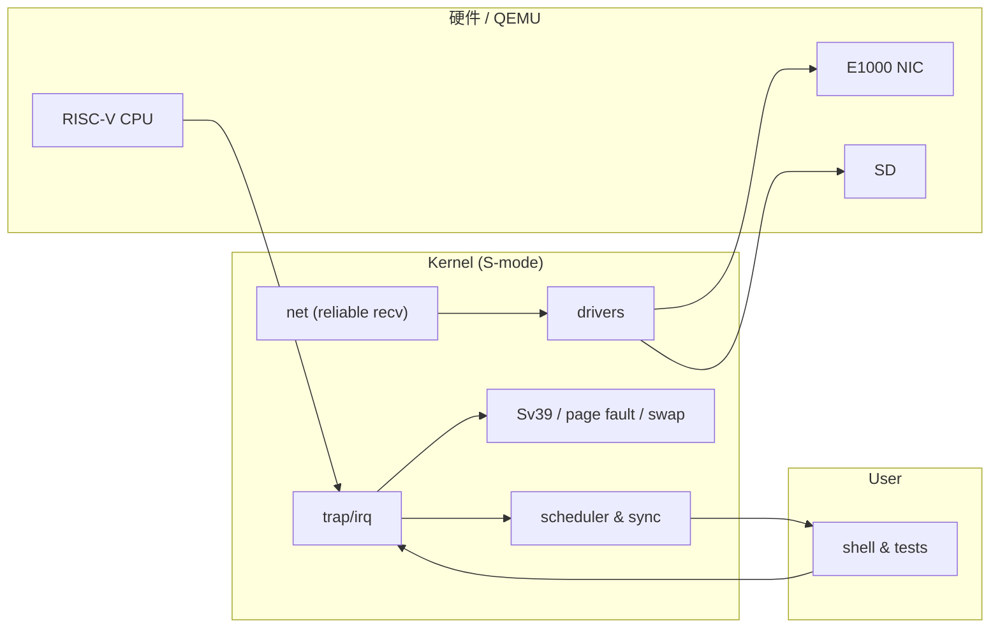

<div align="center">
  
</div>

<div align="center">
  <a href="../../tree/Prj1"></a>
  <a href="../../tree/Prj4"></a>
  <a href="../../tree/Prj5"></a>
  <a href="../../tree/main"></a>
</div>

---

## 这是什么

这个仓库的**内容不集中在一个分支**：每个 `Prj*` 分支对应一个项目阶段/主题，并各自包含完整的文档与实现记录；本分支用于把这些内容“摆上台面”——让人一眼知道该从哪里读、读什么、怎么跳转。

## 你会在这里看到什么

<table>
  <tr>
    <td width="25%"><b>Boot & Image</b><br/>从 Bootloader 到镜像组织、ELF 装载。</td>
    <td width="25%"><b>Kernel Core</b><br/>调度、锁、系统调用、中断与抢占。</td>
    <td width="25%"><b>Virtual Memory</b><br/>Sv39、缺页、Swap、内存统计与调试。</td>
    <td width="25%"><b>Drivers & Net</b><br/>E1000、收发/中断、可靠传输实验。</td>
  </tr>
</table>



---

## 项目分支

> 推荐阅读顺序：`Prj1 → Prj2 → Prj3 → Prj4 → Prj5`（`main` 为当前基线）

<table>
  <tr>
    <td width="33%">
      <h3>Project 1</h3>
      <p><b>引导、镜像、ELF</b></p>
      <p>
        <a href="../../tree/Prj1">进入分支</a> ·
        <a href="../../blob/Prj1/README.md">打开 README</a>
      </p>
      <p>关键词：Boot、createimage、ELF、加载器</p>
    </td>
    <td width="33%">
      <h3>Project 2</h3>
      <p><b>调度、锁、系统调用</b></p>
      <p>
        <a href="../../tree/Prj2">进入分支</a> ·
        <a href="../../blob/Prj2/README.md">打开 README</a>
      </p>
      <p>关键词：PCB、do_scheduler、mutex、ecall、timer IRQ</p>
    </td>
    <td width="33%">
      <h3>Project 3</h3>
      <p><b>综合阶段</b></p>
      <p>
        <a href="../../tree/Prj3">进入分支</a> ·
        <a href="../../blob/Prj3/README.md">打开 README</a>
      </p>
      <p>提示：该分支的 <code>README.md</code> 目前为空（待补充）。</p>
    </td>
  </tr>
  <tr>
    <td width="33%">
      <h3>Project 4</h3>
      <p><b>内存管理与虚拟内存</b></p>
      <p>
        <a href="../../tree/Prj4">进入分支</a> ·
        <a href="../../blob/Prj4/README.md">打开 README</a>
      </p>
      <p>关键词：Sv39、page fault、swap、零拷贝 IPC（页管道）</p>
    </td>
    <td width="33%">
      <h3>Project 5</h3>
      <p><b>网卡驱动与可靠传输</b></p>
      <p>
        <a href="../../tree/Prj5">进入分支</a> ·
        <a href="../../blob/Prj5/README.md">打开 README</a>
      </p>
      <p>关键词：E1000、TX/RX、中断、可靠接收/重传</p>
    </td>
    <td width="33%">
      <h3>Current (main)</h3>
      <p><b>当前工作基线</b></p>
      <p>
        <a href="../../tree/main">进入分支</a> ·
        <a href="../../blob/main/README.md">打开 README</a>
      </p>
      <p>提示：以 <code>main</code> 的内容与状态为准。</p>
    </td>
  </tr>
</table>

---

## 三步开始阅读

1. 打开你关心的 `Prj*` 分支 `README.md`（上面每个卡片都有直达链接）。
2. 按该分支文档的“构建/运行/测试”步骤走一遍。
3. 需要对照源码时，再回到仓库目录结构（`arch/`、`kernel/`、`drivers/`、`test/` 等）。

## 快速切换

```bash
git checkout Prj4
```
